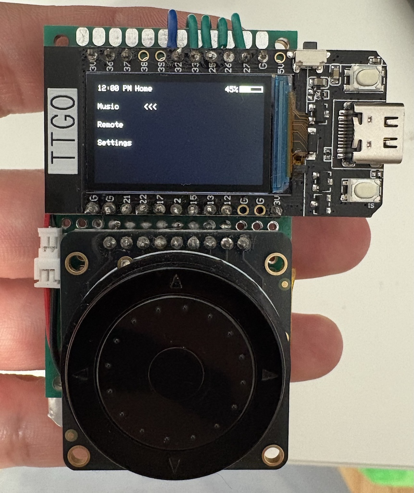
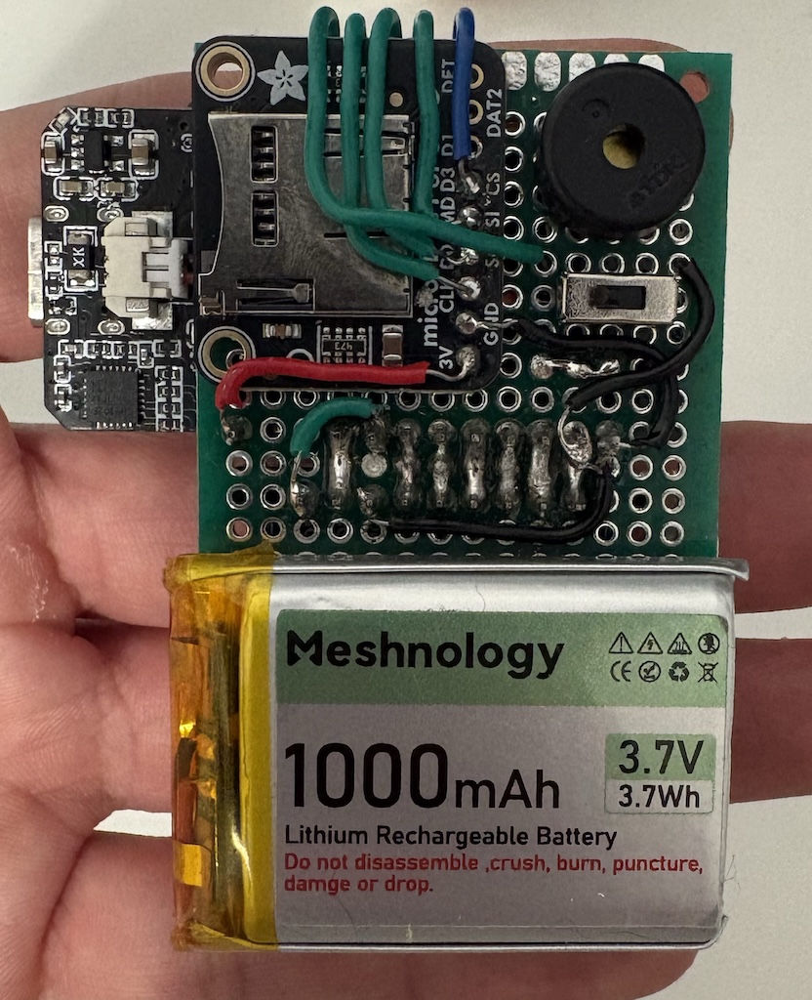

# Doom-Corp-Communicator

# Gallery

### Updates
<ul>
  <li>Battery voltage indicator, powered by the 3.7V LiPo 1000mAh battery</li>
  <li>Slide power switch connected to LiPo battery via JST 1.25</li>
  <li>Menu rough draft, working on preferred spacing for placements</li>
</ul>

### Coming Soon
<ul>
  <li>Configure piezo buzzer for alerts, tones, selections</li>
  <li>Pseudo RTC since no backup battery is installed</li>
  <li>Improved menu
  <li>MP3 music player</li>
  <li>Bluetooth connectivity</li>
</ul>

    
    

